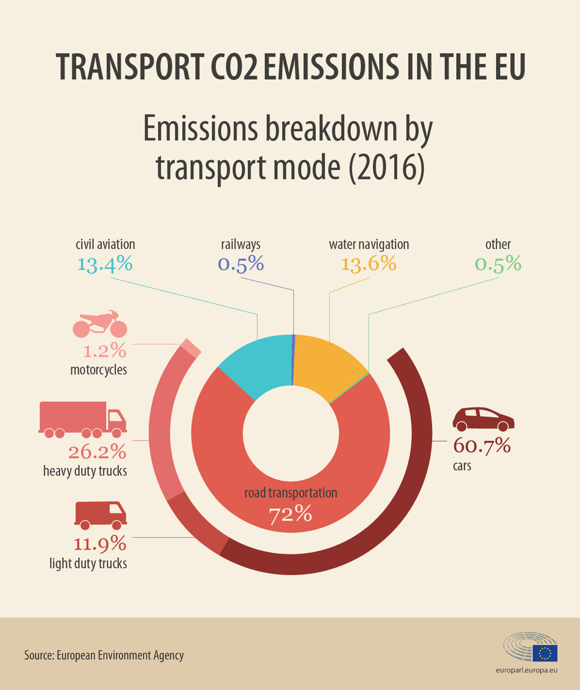

Climate change is for real and multiple scientific evidence that has been provided by scientists and climate change activists to ask for increased action by corporates and individuals alike to actively work towards reversing and/or stopping the phenomena. Corporates especially are increasingly challenged to incorporate visible and meaningful action on climate change in their day to day activities. Investors are also requesting for transparency on corporate greenhouse gases (GHG) emissions and looking forward to strategies to reduce them. This resulted in a shift towards market responses, i.e. proactive managerial and technological measures, such as the establishment of carbon inventories, investments in ‘green’ products and cleaner production processes\[1\]\[2\].

The automotive industry is particularly targeted since the transport industry accounts for around 30% of global carbon dioxide emissions, out of which 72% comes from road transportation\[3\]. Cars are major polluter accounting for 60.7% of total CO2 emissions from road transport in Europe\[3\]. The new CO2 emissions target wants to cut harmful emissions from new automobiles by 30% by 2030, with an intermediate reduction target of 15% by 2025, as compared to 2019 emission levels \[4\]\[5\]. The below infographic shows the emissions breakdown by transport mode.

<figure>

<figcaption>

Emissions breakdown by transport mode (2016) \[3\]

</figcaption>

</figure>

The automotive industry is trying to reduce CO2 emissions by introducing electric cars and stopping the production of ICE (Internal Combustion Engines)\[6\] as a first step. Adopting renewable energy sources is also the first step to develop a means for more sustainable transport. The second and more important step is to go towards autonomous vehicles and inter-vehicular communications using technologies such as 5G, V2X, V2V, etc. to allow for smoother traffic flow as well as avoid accidents, human error and provide for consistent driving behavior to reduce environmental impact. The third step is to reduce the price premium being applied to these new technologies in automobiles and bringing it to the mass-market. The third step is the most critical for automobile manufacturers who need to also maintain profitability as well as introduce and mature newer technologies such as an alternative power train and/or autonomous driving solutions.

New technologies for transmissions, driver assistance systems, alternative construction techniques and materials, new tyre technology and design, new vehicle design to reduce aerodynamic drag and optimal energy management within the vehicle are the key factors that drive the strategies to fight climate change in the automotive industry. PWC lists the following points to be taken into consideration in the strategic objectives & goals aligning with the climate change goals\[7\].

1. Continue to improve on existing portfolio and focus on core competencies
2. Do not ignore any new technology
3. Develop a portfolio of technologies
4. Assess technology acquisition strategies
5. Evolve an effective innovation strategy
6. Develop innovation networks and collaborative communities
7. Manage the network risks
8. Cooperate not only within the automotive sector but also with the fuel industry
9. Pursue and agree on industry standards for new technologies
10. Communicate the success and achievements

\[1\] - Weinhofer, G. and Hoffmann, V.H. (2008). Mitigating climate change - how do corporate strategies differ? _Business Strategy and the Environment_, 19(2), pp.77–89  
\[2\] - Jeswani, H.K., Wehrmeyer, W. and Mulugetta, Y. (2007). How warm is the corporate response to climate change? Evidence from Pakistan and the UK. _Business Strategy and the Environment_, 17(1), pp.46–60  
\[3\] - European Parliament, CO2 emissions from cars: facts and figures (infographics) (2019). _CO2 emissions from cars: facts and figures (infographics) | News | European Parliament_. \[online\] Europa.eu. Available at: https://www.europarl.europa.eu/news/en/headlines/society/20190313STO31218/co2-emissions-from-cars-facts-and-figures-infographics \[Accessed 30 Oct. 2019\]  
\[4\] - European Parliament, Reducing car emissions: new CO2 targets for cars explained (2018). _Reducing car emissions: new CO2 targets for cars explained | News | European Parliament_. \[online\] Europa.eu. Available at: https://www.europarl.europa.eu/news/en/headlines/society/20180920STO14027/reducing-car-emissions-new-co2-targets-for-cars-explained \[Accessed 30 Oct. 2019\]  
\[5\] - European Parliament, MEPs approve new CO2 emissions limits for trucks (2019). _MEPs approve new CO2 emissions limits for trucks  | News | European Parliament_. \[online\] Europa.eu. Available at: https://www.europarl.europa.eu/news/en/press-room/20190412IPR39009/meps-approve-new-co2-emissions-limits-for-trucks \[Accessed 30 Oct. 2019\]  
\[6\] - [http://www.climateaction.org/news/volvo-to-stop-making-new-diesel-cars](http://www.climateaction.org/news/volvo-to-stop-making-new-diesel-cars)  
\[7\] - Pricewaterhouse Coopers (PWC) (2007). _The automotive industry and climate change Framework and dynamics of the CO2 (r)evolution_. \[online\] Available at: https://www.pwc.com/th/en/automotive/assets/co2.pdf \[Accessed 30 Oct. 2019\]

‌

‌

‌

‌

‌

‌
