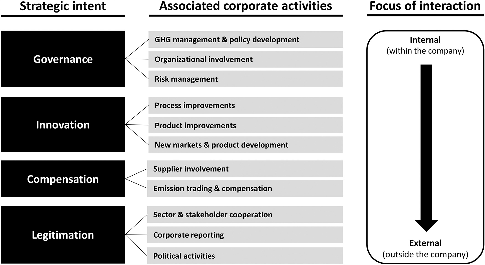

The literature on climate change strategies converges on 4 main strategic intents namely governance, innovation, compensation, and legitimation. The figure below identifies a corporate climate change strategy framework. The different corporate activities are grouped into 4 strategic intent with a focus of interaction / self-containment levels in each of those activities\[1\].

Governance which is defined as an organization's ability to deal with risks and opportunities deals with GHG (Green House Gas) management and associated policy development, organization involvement and risk management. All of these corporate activities are mostly internal to the company and if done properly can be effectively used to formulate and strategize the corporate vision around climate change. Innovation is geared towards the improvement of existing products and processes as well as embracing any new technologies that can accelerate and conform to the various standards related to climate change activities and impact reduction. Compensation is the action taken by an organization to reduce its carbon footprint like buying CO2 credits or enhancing carbon sinks. The organization's own technological assets and competencies remain unaltered. Legitimation encompasses the activities aimed at retaining or gaining legitimacy around the various activities done by the organization.

There are multiple foci of interaction which can mainly be categorized into internal collaboration and external collaboration with actors outside the field of influence of the organization.

<figure>

<figcaption>

Corporate climate change strategy framework

</figcaption>

</figure>

If an organization fine-tunes its various activities taking climate change into consideration and keeping the 4 points listed above as strategic intent; they can very easily influence the strategic objectives and resulting portfolio strategy to comply and offer products that have a minimal carbon footprint. A more mature organization can also take an active role in the compensation and legitimation intent to steer the climate change debate to its advantage.

\[1\] - Damert, M., & Baumgartner, R. J. (2017). Intra-Sectoral Differences in Climate Change Strategies: Evidence from the Global Automotive Industry. _Business Strategy and the Environment_, _27_(3), 265–281. https://doi.org/10.1002/bse.1968

‌
